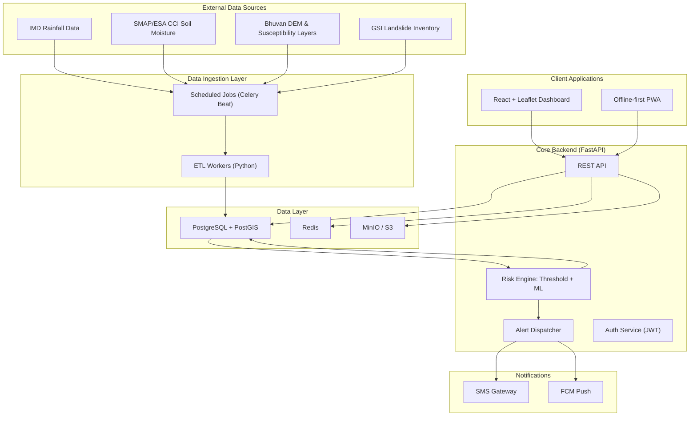

# SIH26001 — AI-Based Early Warning and Landslide Risk Monitoring System (NER)

> Smart India Hackathon 2026 — Problem Statement SIH26001

## Problem Statement

The North Eastern Region of India faces frequent rainfall-triggered landslides. GSI's LANDSLIP project does not yet cover NER (listed as a planned future expansion state). This system applies NE-Himalaya-specific rainfall thresholds from peer-reviewed research to close that regional gap, with a citizen-reporting layer that GSI's system lacks.

**We are NOT claiming to invent landslide prediction — we are closing a real regional coverage gap.**

## Architecture



## Local Setup

### Prerequisites
- Docker and Docker Compose
- Python 3.11+
- Node.js 20+

### 1. Start infrastructure
```bash
cd infra
docker compose up -d
```

This starts:
- **PostgreSQL + PostGIS** on port 5432
- **Redis** on port 6379
- **MinIO** (object storage) on ports 9000/9001
- **Backend** (FastAPI) on port 8000

### 2. Run backend locally
```bash
cd backend
python -m venv .venv
source .venv/bin/activate
pip install -r requirements.txt
uvicorn app.main:app --reload --port 8000
```

### 3. Run dashboard
```bash
cd frontend-dashboard
npm install
npm run dev
# Opens at http://localhost:5173
```

### 4. Run field PWA
```bash
cd field-app-pwa
npm install
npm run dev
# Opens at http://localhost:5174
```

### 5. Verify
```bash
curl http://localhost:8000/health
# {"status":"ok","version":"0.1.0"}
```

## Tech Stack

| Layer | Choice | Why |
|-------|--------|-----|
| Backend | Python 3.11 + FastAPI | Async, ML-native |
| ML | scikit-learn / XGBoost | Explainable, defensible |
| Database | PostgreSQL + PostGIS | Geospatial queries |
| Cache/Queue | Redis + Celery | Scheduled jobs, alerts |
| Dashboard | React + Leaflet | GIS heatmaps |
| Field App | React PWA + Workbox | Offline-first |
| SMS | MSG91/Twilio (mock in dev) | NER connectivity reality |
| CI/CD | GitHub Actions | Lint + test on PR |

## Project Structure

```
sih26001-landslide-ews/
├── backend/                  # FastAPI + SQLAlchemy + Celery
├── frontend-dashboard/       # React + Leaflet GIS dashboard
├── field-app-pwa/            # Offline-first PWA
├── ml-notebooks/             # Model training, validation reports
├── data/                     # Raw, processed, reference data
├── infra/                    # Docker Compose
├── docs/                     # Architecture, API, demo script
├── .github/workflows/        # CI pipelines
└── README.md
```

## Differentiation from GSI LANDSLIP

- **NER coverage gap:** LANDSLIP is not yet active in NER
- **Published thresholds:** NE-Himalaya rainfall-threshold equations from peer-reviewed research
- **Explainability:** Every alert includes WHY it fired (threshold vs actual)
- **Citizen reporting:** Ground-truth hazard reports from field officials and citizens

## License

SIH26001 Project
