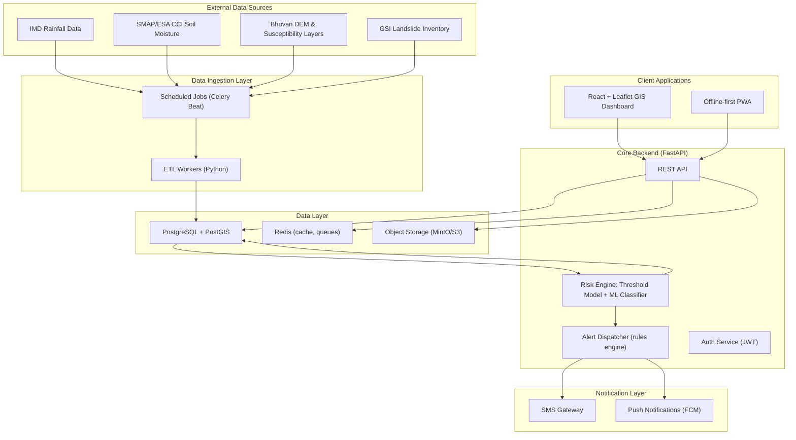

# Architecture

## System Overview

A cloud-hosted, offline-tolerant platform that fuses rainfall/soil-moisture/terrain/satellite data with published NE-Himalaya rainfall-threshold research to classify landslide risk by zone, push multilingual alerts to district administrations and citizens, and let field officials/citizens report ground-truth hazards via geo-tagged photo uploads.

## User Classes

- **District Disaster Management Authorities** — risk dashboard, alert dispatch, road connectivity
- **Field officials / citizens** — lightweight PWA, offline-first reporting, SMS alerts
- **System/ML pipeline** — data ingestion, risk recomputation, alert triggers

## Data Flow

## Tech Stack

| Layer | Choice |
|-------|--------|
| Backend | Python 3.11 + FastAPI |
| ML | scikit-learn / XGBoost |
| Database | PostgreSQL + PostGIS |
| Cache/Queue | Redis + Celery |
| Object Storage | MinIO (local) / AWS S3 |
| Dashboard | React + TypeScript + Leaflet.js |
| Field App | React PWA with Workbox |
| Notifications | MSG91/Twilio (SMS) + FCM (push) |
| CI/CD | GitHub Actions |
| Infra | Docker Compose (local) |

## Differentiation

This system applies NE-Himalaya-specific rainfall thresholds from peer-reviewed research to close the regional coverage gap left by GSI's LANDSLIP system (NER is a planned, not yet active, expansion state). It adds a citizen-reporting layer that GSI's system lacks.
